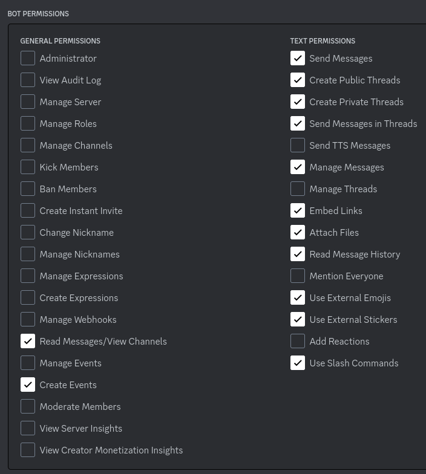
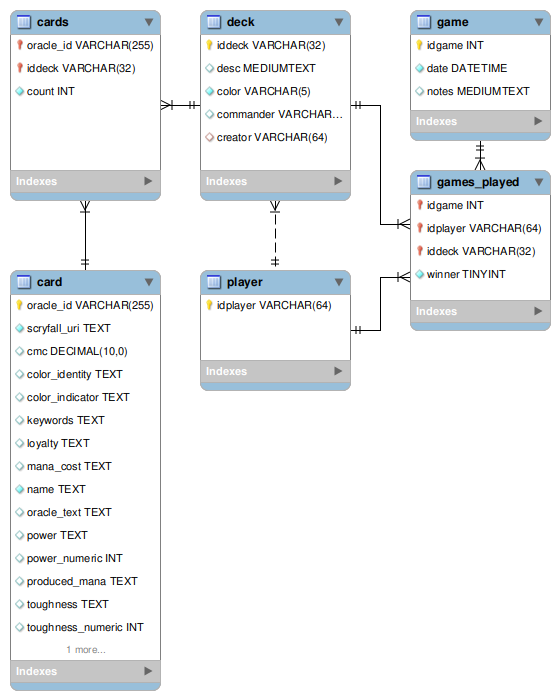

# Setup Guide
How to get yourself going to use this 'locally'. Requires setting up a mysql database and creating a bot associated with your discord account. 

1. [Get the code](#1---get-code)
   - Install requirements
2. [Create bot account](#2---create-bot-account)
   - Create bot on discord developer page
   - Save your bot token
   - Create an 'invite link' with the required permissions
3. [Setup database](#3---setup-database)
4. [Create environment file](#4---create-env-file)
   - Holds your secrets; tokens, database credentials
5. [Create Schema](#5---create-schema)
6. [Run the bot](#6---run-the-bot)
7. [Invite and test the bot](#7---invite-and-test-the-bot)

## 1 - Get Code
Clone the repository, and install dependencies listed in the requirements file. `pip install -r requirements.txt`. 

## 2 - Create bot account
Follow the instructions provided by the discord.py documentation for creating a bot account associated with your discord user [here](https://discordpy.readthedocs.io/en/stable/discord.html). Make sure to save the bot tokens for later. Follow the instructions up to the point of creating the invite URL for the bot. Follow similar steps, selecting the `bot` scope, but ensure that the follow permissions are set before generating the link. 



Copy the link to add the bot to whatever server you're testing from. You may need to regen this as needed? I think it has a timeout. 

## 3 - Setup database
Figure out how to get mysql installed and running on your machine. Make sure to have a properly privileged, non-root user created. Make sure to make note of the user name and password for this user, to be added to the environment file later.

## 4 - Create Env File
This project uses the decouple-config module to read an environment file containing secrets and credentials. It assumes a file named `.env` with the following information is present in the root of the project. Create one and fill it in with the saved information from prior steps. Make sure to add this to any gitignores or exclusion files used by your ide/cvs. 

```commandline
DISCORD_BOT_TOKEN="<Saved from before>"
DB_USER="<saved from before>"
DB_PASSWORD="<saved from before>"
DB_HOST="localhost"
```

## 5 - Create Schema
Now that we have all our dependencies installed and database created, we can use the provided `create_db.py` script to create the required tables for the bots functions. Run the script from the root with `python create_db.py`. Use your mysql interface of choice to check that you have a schema that looks something like this:



## 6 - Run the bot.
From the root of the project, run `python run.py`. Check the run script to make sure that your env variable name for the token matches what is called out in the script. 

## 7 - Invite and test the bot.
Use your invite link to invite the bot. To test it, send it some commands via direct message. Add a deck, some cards, and then try to view the summary and cards. Check that the cards and decks are actually in your database. 

If you have any issues, please reach out! This is still very much in development, so I am certain there will be hiccups, but hopefully all of them are only a few edits away from unblocking.


